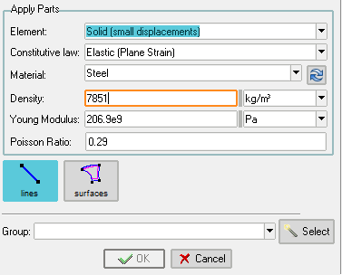

# Select material in a part
You can choose between 2 ways: select the properties or select the whole material.

## Select properies
This mode is useful when you need to apply small changes to a predefined material. For example, imagine you have Steel, and you want to use all the properties as they are, but applying a different density to each part of the model. 

Notice that changing the material in the combo (and press the update button, for safety) will update the material properties, taking the values from the material's database.

## Select material
